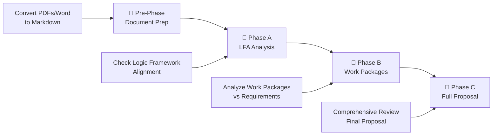

# 🚀 Proposal Framework - AI-Powered Proposal Development

> **Transform your proposal development from chaotic to systematic**

A smart 3-phase framework that guides you from initial concept to polished proposal, using AI to catch issues early and ensure alignment with funding requirements.

---

## 🎯 **Why This Framework?**

**The Problem:** Proposal development is messy. Documents evolve, requirements change, and critical misalignments are often discovered too late.

**The Solution:** This framework provides:
- **Early Detection** - Catch alignment issues before they become problems
- **Systematic Review** - AI-powered analysis with human oversight
- **Clear Progress** - Know exactly where you stand at each phase
- **Version Control** - Track changes and maintain audit trails
- **Cost Transparency** - Real-time cost tracking and budget planning

---

## 🏊‍♂️ **The 3-Phase Swimlane**



### **📄 Pre-Phase: Document Preparation**
**What it does:** Prepares all your documents for analysis
- Converts PDFs and Word docs to markdown
- Organizes files for processing
- Creates version-controlled snapshots

**When to use:** Before starting any phase. Re-run only if call documents change.

### **🔷 Phase A: Logic Framework Analysis**
**What it does:** Establishes your proposal foundation
- Analyzes your Logic Framework against funding call requirements
- Checks if objectives align with call goals
- Verifies internal logic and consistency
- Evaluates writing quality and clarity
- **Cost:** ~$0.009-$0.295 per analysis (depending on AI model)

**When to use:** When you have a draft Logic Framework. Run repeatedly during the LFA iteration loop (see below).

### **🔷 Phase B: Work Packages Analysis**
**What it does:** Ensures detailed alignment
- Analyzes individual work packages
- Checks alignment with LFA and call requirements
- Assesses objectives, tasks, deliverables, and milestones
- Identifies gaps and inconsistencies

**When to use:** When the LFA is solid and Phase A scores are acceptable.

### **🔷 Phase C: Full Proposal Analysis**
**What it does:** Comprehensive final review
- Integrates LFA, work packages, and main proposal
- Provides overall project assessment and scoring
- Generates final recommendations
- Creates comprehensive analysis report

**When to use:** When you have a complete proposal draft.

---

## 🔄 **LFA Iteration Loop (Phase A only)**

The most important workflow during proposal development is the **LFA iteration loop** — editing the Logic Framework and running Phase A reviews repeatedly until the scores are acceptable. Phase B and C only come after the LFA is solid.

```
edit lfa_iteration_input.md  →  sync  →  Phase A reviews  →  new improvement_guide.md
         ↑                                                              |
         └──────────────── refine based on feedback ───────────────────┘
```

### **Setup (one-time per call)**

```bash
# Seed the working LFA file from the latest Phase A output
python3 init_lfa_draft.py --call esa/responsible-fishing
```

This creates `input/lfa_documents/lfa_iteration_input.md` — a clean copy of the current structured LFA. **This is the only file you edit between Phase A runs.**

> ⚠️ Do not edit `output/phase_a/lfa_restructured/lfa_structured.md` or `output/phase_a/improvement_guide.md` directly — they are regenerated on every Phase A run.

### **Iteration cycle**

1. Open `input/lfa_documents/lfa_iteration_input.md` in your editor
2. Open `output/phase_a/improvement_guide.md` alongside it as read-only reference
3. Edit the LFA sections based on the review feedback
4. Run Phase A on your changes:

```bash
python3 sync_lfa_draft.py --call esa/responsible-fishing
```

Or post `sync` in the call's Slack channel (see [Slack integration](#-slack-integration) below).

5. Check the updated scores in the new `improvement_guide.md`
6. Repeat until scores are acceptable

### **File roles**

| File | Role | Edited by |
|------|------|-----------|
| `input/lfa_documents/lfa_iteration_input.md` | Working LFA — the file you edit | Moderator in Cursor |
| `output/phase_a/lfa_restructured/lfa_structured.md` | Latest Phase A structured output | Auto-generated |
| `output/phase_a/improvement_guide.md` | Section-by-section feedback with scores | Auto-generated |
| `output/discussions/lfa_structured_archive_*.md` | Archived previous versions | Auto-generated |

### **Scripts**

| Script | Purpose |
|--------|---------|
| `init_lfa_draft.py --call <slug>` | Seed `lfa_iteration_input.md` from current Phase A output (run once, or after a major Phase A rerun) |
| `sync_lfa_draft.py --call <slug>` | Push edits through Phase A — archives old output, copies input, runs reviews |

---

## 💬 **Slack Integration**

Each call has a dedicated Slack channel for team collaboration and LLM-assisted discussion between Phase A runs.

### **Channel naming**

`#callio-{call-slug}` — e.g. `#callio-esa-responsible-fishing`

One channel = one call = one bounded LFA context. Nina (the AI assistant) is scoped to that call only when active in the channel.

### **Setup (one-time per channel)**

1. Create a private Slack channel named `#callio-{call-slug}`
2. Invite Nina to the channel
3. Nina auto-posts a context summary and a pinned commands card

### **Sync command**

Post `sync` in the channel to push your `lfa_iteration_input.md` edits through Phase A. Nina runs `sync_lfa_draft.py`, streams the Phase A output, and posts the updated score summary back to the channel when done.

### **Discussion session**

For deeper LLM-assisted work on the LFA, start a discussion session:

```
start discussion
```

Nina loads the full project context (structured LFA, both review files, call context, team notes) and enters an interactive session. Commands during a session:

| Command | Action |
|---------|--------|
| `/draft` | Generate a full improved LFA draft based on discussion so far |
| `/diff` | Show what changed vs the baseline LFA |
| `/finalize` | Produce `improved_lfa.md` + `.docx` + transcript + change summary |
| `/save` | Checkpoint the session |
| `/show lfa\|structural\|alignment\|call\|team` | Display a loaded context section |

On `/finalize`, the improved LFA is placed in `input/lfa_documents/` automatically so the next Phase A run picks it up.

### **Team notes**

Paste collected team feedback directly in the channel before starting a session. Nina collects it into `input/team_notes.md` so it becomes part of the LLM context.

### **Editing workflow with Slack**

1. Edit `lfa_iteration_input.md` in Cursor (improvement_guide.md open alongside as reference)
2. Post `sync` in the Slack channel
3. Nina runs Phase A, posts updated scores to the channel
4. Optionally: post `start discussion` for LLM-assisted rewrite of specific sections
5. Repeat

---

## 💰 **Cost Analysis & Budget Planning**

### **AI Model Costs (per Phase A analysis):**
| Model | Cost | Best For |
|-------|------|----------|
| **GPT-4o-mini** | $0.009 | **Recommended** - Best value |
| **GPT-3.5-turbo** | $0.081 | Good balance |
| **GPT-4o** | $0.295 | Premium quality |

### **Cost Tracking Features:**
- ✅ **Real-time tracking** of token usage and costs
- ✅ **Detailed breakdown** in JSON outputs and reports
- ✅ **Budget planning** with cost estimates
- ✅ **Test mode** for development without API costs

### **Budget Planning:**
- **Single analysis**: $0.009 - $0.295
- **10 analyses**: $0.09 - $2.95
- **Monthly budget**: $5-50 covers most use cases

> 💡 **Tip:** Use GPT-4o-mini for 90% cost savings with excellent results!

📋 **Detailed Cost Analysis:** See [`COST_ANALYSIS.md`](COST_ANALYSIS.md) for comprehensive pricing breakdown and budget planning.

---

## 🚀 **Quick Start**

### **1. Setup (One-time)**
```bash
# Activate virtual environment
source .venv/bin/activate

# Verify setup
python run_phase_a.py --help
```

### **2. Prepare Documents**
```bash
# Convert all documents to markdown
python run_pre_phase.py
```

### **3. Run Phases**
```bash
# Simple approach - use the launcher
python launch.py A    # Phase A
python launch.py B    # Phase B  
python launch.py C    # Phase C

# Or run directly
python run_phase_a.py
python run_phase_b.py
python run_phase_c.py
```

### **4. Run Pipeline (Block-by-Block)**
```bash
# Run full sequence: pre -> phase_a -> phase_b -> phase_c
python3 run_pipeline.py --call esa-responsible-fishing

# Run only one block
python3 run_pipeline.py --call esa-responsible-fishing --only pre

# Run a range
python3 run_pipeline.py --call esa-responsible-fishing --from phase_a --to phase_b
```

Pipeline outputs:
- `calls/<call>/output/pipeline_runs/<run_id>/state.json`
- `calls/<call>/output/pipeline_runs/<run_id>/artifacts.json`

---

## 🎛️ **Review Modes**

### **Python Mode (Default)**
- **Best for:** Systematic checks, consistency, compliance
- **What it does:** Rules-based analysis with quantitative scoring
- **Speed:** Fast and consistent
- **Output:** Detailed breakdowns with specific scores

### **LLM Mode**
- **Best for:** Strategic assessment, nuanced understanding
- **What it does:** AI-powered contextual analysis
- **Speed:** Slower but more insightful
- **Output:** Qualitative insights and recommendations

**Switch modes:**
```bash
python run_phase_a.py --mode llm
python run_phase_b.py --mode python
```

---

## 📁 **File Organization**

```
📂 Your Project/
├── 📄 input/
│   ├── 📄 call_documents/     # Funding call PDFs + processed MD files
│   ├── 📄 lfa_documents/      # Logic Framework drafts + processed MD files
│   ├── 📄 work_packages/      # Work package drafts + processed MD files
│   └── 📄 strategy_documents/ # Strategy and policy docs + processed MD files
├── 📄 output/
│   ├── 📄 logs/               # Processing logs
│   ├── 📄 snapshots/          # Version control
│   └── 📄 reports/            # Analysis reports
└── 📄 config/                 # Configuration files
```

### **📋 Required Documents by Phase**

**Pre-Phase (Document Preparation):**
- Any PDF or Word documents you want to process
- The framework will convert them to markdown automatically

**Phase A (LFA Analysis):**
- `lfa_documents/Your_Logic_Framework.docx`
- `call_documents/funding_call.pdf` (or processed markdown)
- `strategy_documents/strategy_docs.pdf` (optional)

**Phase B (Work Packages):**
- All Phase A documents, plus:
- `work_packages/Your_WP1.docx`
- `work_packages/Your_WP2.docx`
- `work_packages/Your_WP3.docx`
- (etc. for all work packages)

**Phase C (Full Proposal):**
- All Phase A & B documents, plus:
- `main_proposals/Your_Complete_Proposal.docx`

### **📝 Document Setup Process**

1. **Upload your documents** to the appropriate `input/` folders
2. **Run pre-phase** to convert everything to markdown:
   ```bash
   python run_pre_phase.py
   ```
3. **Verify setup** by checking what's available:
   ```bash
   python run_phase_a.py --list-documents
   ```

### **📋 File Naming Tips**

- Use descriptive names with your project prefix
- Include version dates where helpful
- Keep original names for uploaded documents
- The framework handles the rest automatically

**Examples:**
- `Project_Logical_Framework.docx`
- `Funding_Call_Content.md`
- `Project_WP1.docx`

---

## 🔧 **Common Commands**

### **Check What's Available**
```bash
python run_phase_a.py --list-documents
python run_phase_b.py --list-documents
python run_phase_c.py --list-documents
```

### **Run with Specific Options**
```bash
# Use LLM mode for deeper analysis
python run_phase_a.py --mode llm

# Specify funding type
python run_phase_a.py --funding-type horizon_eu

# Enable verbose logging
python run_phase_a.py --verbose
```

### **Word Report Generation**

Word reports are generated on-demand using the dedicated script to avoid cluttering the output directory:

```bash
# Generate Word report from latest JSON file
python scripts/generate_word_report.py

# Generate Word report from specific JSON file
python scripts/generate_word_report.py output/phase_a/review_results/lfa_review_result_YYYYMMDD_HHMMSS.json

# Generate Word report with custom output name
python scripts/generate_word_report.py output/phase_a/review_results/lfa_review_result_YYYYMMDD_HHMMSS.json my_report.docx
```

This approach ensures only one Word document per review session and allows you to generate reports only when needed.

### **Troubleshooting**

#### **Common Issues:**
- **Import errors**: Make sure you're in the project root directory
- **Missing documents**: Check that required files are in the correct folders
- **Permission errors**: Ensure you have write access to the output directory
- **API quota exceeded**: Check your OpenAI account billing and usage limits

#### **Cost & API Issues:**
- **Error 429 (Quota exceeded)**: 
  - Check OpenAI account billing at [platform.openai.com](https://platform.openai.com)
  - Use test mode for development: Set `test_mode=True` in `run_phase_a.py`
  - Switch to cheaper model: Change to `gpt-4o-mini` for 90% cost reduction

#### **Framework Commands:**
   ```bash
# Check configuration
python scripts/framework.py --validate-config

# View available funding types
python scripts/framework.py --list-funding-types

# Run with test mode (no API costs)
python run_phase_a.py --verbose  # Uses test_mode=True
   ```

---

## 📊 **What You Get**

Each phase generates:
- **📄 Markdown Reports** - Human-readable analysis with cost breakdown
- **📊 JSON Data** - Structured data for dashboards with cost tracking
- **📝 Word Documents** - Shareable reports
- **📸 Snapshots** - Version-controlled history
- **💰 Cost Analysis** - Real-time cost tracking and budget monitoring

---

## 🎯 **Success Tips**

1. **Start Early** - Run Phase A as soon as you have a draft LFA
2. **Iterate** - Use feedback to improve documents before moving to next phase
3. **Check Alignment** - Ensure each phase builds on the previous one
4. **Monitor Costs** - Use GPT-4o-mini for 90% cost savings with excellent results
5. **Test Mode** - Use test mode for development and testing without API costs
6. **Review Reports** - Don't just generate reports, act on the feedback
7. **Version Control** - Keep snapshots to track your progress

---

## 🆘 **Need Help?**

- **Missing Documents?** Run `--list-documents` to see what's available
- **Configuration Issues?** Check `config/REVIEW_MODES_EXPLAINED.md`
- **Want to Customize?** Edit files in `config/funding_types/`

---

*Built for clarity, designed for results. Transform your proposal development today.*